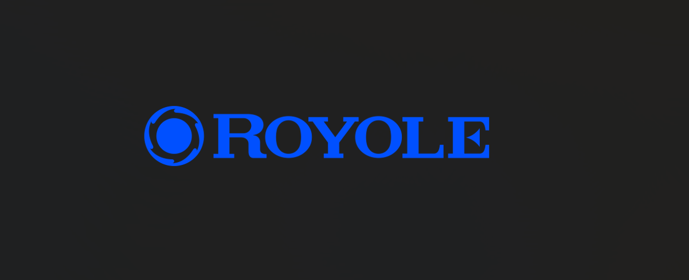

<!DOCTYPE html>
<html lang="en">
<head>
    <meta charset="UTF-8">
    <meta name="viewport" content="width=device-width, initial-scale=1.0">
    <title>Royole Corporation - Welcome</title>
    <link href="https://cdn.jsdelivr.net/npm/tailwindcss@2.2.19/dist/tailwind.min.css" rel="stylesheet">
    
    
</head>
<body class="bg-black-100">
   
    
   

    </body>
    <!-- Navigation -->
    <nav class="bg-black-600 text-white p-4 sticky top-0 z-50 shadow-md">
        

            <a href="/" class="text-2xl font-bold flex items-center">
                Royole
            </a>
            

                <a href="product.html" class="nav-link hover:text-gray-200">Products</a>
                <!-- <a href="/solutions" class="nav-link hover:text-gray-200">Solutions</a> -->
                <a href="about.html" class="nav-link hover:text-gray-200">About</a>
                <a href="contact.html" class="nav-link hover:text-gray-200">Contact</a>
                <a href="ai_assistant.html" class="nav-link">AI Assistant</a>

                <a href="login.html" class="nav-link hover:text-gray-200">Login</a>
                <a href="signup.html" class="bg-white text-blue-600 px-4 py-2 rounded-lg hover:bg-gray-100 transition duration-300">Sign Up</a>
            

        

    </nav>

    <!-- Flash Messages -->
    

        <!-- Messages will be dynamically inserted here -->
    

    <!-- Main Content -->
    

        <!-- Hero Section -->
        

            

            

                

                    <h1 class="text-5xl font-bold mb-4">Innovating Flexible Electronics</h1>
                    
Leading the revolution in flexible displays and sensors technology

                    
                        Explore Our Products
                    </a> -->
                    <a href="#" id="explore-products" class="bg-white text-blue-700 px-8 py-3 rounded-lg font-semibold hover:bg-gray-100 transition duration-300">
                        Explore Our Products
                    </a>
                    
                    
                    
                

            

        

        <!-- Features Section -->
        

            

                

                    

                        

                            <svg class="w-6 h-6 text-blue-600" fill="none" stroke="currentColor" viewBox="0 0 24 24">
                                <path stroke-linecap="round" stroke-linejoin="round" stroke-width="2" d="M9.663 17h4.673M12 3v1m6.364 1.636l-.707.707M21 12h-1M4 12H3m3.343-5.657l-.707-.707m2.828 9.9a5 5 0 117.072 0l-.548.547A3.374 3.374 0 0014 18.469V19a2 2 0 11-4 0v-.531c0-.895-.356-1.754-.988-2.386l-.548-.547z"/>
                            </svg>
                        

                        <h3 class="text-xl font-semibold mb-2">Innovation</h3>
                        
Pioneering next-generation flexible display technology and solutions

                    

                    

                        

                            <svg class="w-6 h-6 text-blue-600" fill="none" stroke="currentColor" viewBox="0 0 24 24">
                                <path stroke-linecap="round" stroke-linejoin="round" stroke-width="2" d="M17 20h5v-2a3 3 0 00-5.356-1.857M17 20H7m10 0v-2c0-.656-.126-1.283-.356-1.857M7 20H2v-2a3 3 0 015.356-1.857M7 20v-2c0-.656.126-1.283.356-1.857m0 0a5.002 5.002 0 019.288 0M15 7a3 3 0 11-6 0 3 3 0 016 0zm6 3a2 2 0 11-4 0 2 2 0 014 0zM7 10a2 2 0 11-4 0 2 2 0 014 0z"/>
                            </svg>
                        

                        <h3 class="text-xl font-semibold mb-2">Partnership</h3>
                        
Collaborating with industry leaders to shape the future of electronics

                    

                    

                        

                            <svg class="w-6 h-6 text-blue-600" fill="none" stroke="currentColor" viewBox="0 0 24 24">
                                <path stroke-linecap="round" stroke-linejoin="round" stroke-width="2" d="M9 12l2 2 4-4m5.618-4.016A11.955 11.955 0 0112 2.944a11.955 11.955 0 01-8.618 3.04A12.02 12.02 0 003 9c0 5.591 3.824 10.29 9 11.622 5.176-1.332 9-6.03 9-11.622 0-1.042-.133-2.052-.382-3.016z"/>
                            </svg>
                        

                        <h3 class="text-xl font-semibold mb-2">Quality</h3>
                        
Committed to delivering exceptional products and customer satisfaction

                    

                

            

        

        <!-- About Section -->
        

            

                

                    <h2 class="text-3xl font-bold mb-6">About Royole</h2>
                    

                        Royole Corporation is a pioneer and global leader in flexible technology innovation, striving to improve the way people interact with and perceive their world. Our breakthrough technologies and solutions bring flexibility into electronics and transform traditional industries.
                    

                    <a href="about.html" class="text-blue-600 font-semibold hover:text-blue-700">Learn More About Us →</a>
                

            

        

        <!-- CTA Section -->
        

            

                <h2 class="text-3xl font-bold text-white mb-4">Ready to Transform Your Business?</h2>
                
Connect with our team to explore how our flexible technology can benefit you

                <a href="contact.html" class="bg-white text-blue-700 px-8 py-3 rounded-lg font-semibold hover:bg-gray-100 transition duration-300">
                    Contact Us Today
                </a>
            

        

    

    <!-- Footer -->
    <footer class="bg-gray-800 text-white py-8 mt-16">
        

            

                

                    <h4 class="text-lg font-semibold mb-4">About Royole</h4>
                    <ul class="space-y-2">
                        <li><a href="about.html" class="hover:text-blue-400">Our Story</a></li>
                        <li><a href="about.html" class="hover:text-blue-400">Our Team</a></li>
                        <li><a href="about.html" class="hover:text-blue-400">Careers</a></li>
                    </ul>
                

                

                    <h4 class="text-lg font-semibold mb-4">Products</h4>
                    <ul class="space-y-2">
                        <li><a href="product.html" class="hover:text-blue-400">Flexible Displays</a></li>
                        <li><a href="product.html" class="hover:text-blue-400">Sensors</a></li>
                        <li><a href="product.html" class="hover:text-blue-400">Solutions</a></li>
                    </ul>
                

                

                    <h4 class="text-lg font-semibold mb-4">Support</h4>
                    <ul class="space-y-2">
                        <li><a href="contact.html" class="hover:text-blue-400">Contact Us</a></li>
                        <li><a href="contact.html" class="hover:text-blue-400">Technical Support</a></li>
                        <li><a href="contact.html" class="hover:text-blue-400">FAQ</a></li>
                    </ul>
                

                

                    <h4 class="text-lg font-semibold mb-4">Connect</h4>
                    <ul class="space-y-2">
                        <li><a href="about.html" class="hover:text-blue-400">Newsletter</a></li>
                        <li><a href="about.html" class="hover:text-blue-400">Blog</a></li>
                        <li class="flex space-x-4">
                            <a href="#" class="hover:text-blue-400">
                                <svg class="w-6 h-6" fill="currentColor" viewBox="0 0 24 24"><path d="M24 12.073c0-6.627-5.373-12-12-12s-12 5.373-12 12c0 5.99 4.388 10.954 10.125 11.854v-8.385H7.078v-3.47h3.047V9.43c0-3.007 1.792-4.669 4.533-4.669 1.312 0 2.686.235 2.686.235v2.953H15.83c-1.491 0-1.956.925-1.956 1.874v2.25h3.328l-.532 3.47h-2.796v8.385C19.612 23.027 24 18.062 24 12.073z"/></svg>
                            </a>
                            <a href="#" class="hover:text-blue-400">
                                <svg class="w-6 h-6" fill="currentColor" viewBox="0 0 24 24"><path d="M23.953 4.57a10 10 0 01-2.825.775 4.958 4.958 0 002.163-2.723c-.951.555-2.005.959-3.127 1.184a4.92 4.92 0 00-8.384 4.482C7.69 8.095 4.067 6.13 1.64 3.162a4.822 4.822 0 00-.666 2.475c0 1.71.87 3.213 2.188 4.096a4.904 4.904 0 01-2.228-.616v.06a4.923 4.923 0 003.946 4.827 4.996 4.996 0 01-2.212.085 4.936 4.936 0 004.604 3.417 9.867 9.867 0 01-6.102 2.105c-.39 0-.779-.023-1.17-.067a13.995 13.995 0 007.557 2.209c9.053 0 13.998-7.496 13.998-13.985 0-.21 0-.42-.015-.63A9.935 9.935 0 0024 4.59z"/></svg>
                            </a>
        
&copy; 2024 Royole Corporation. All rights reserved.

    </footer>
